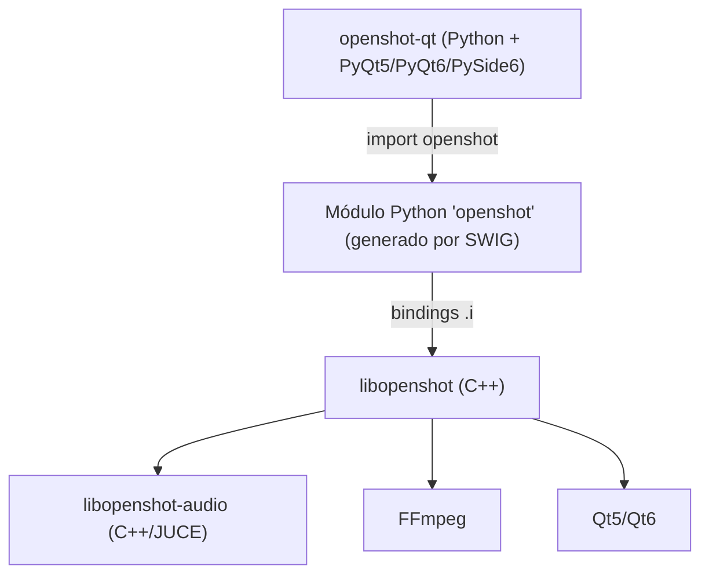
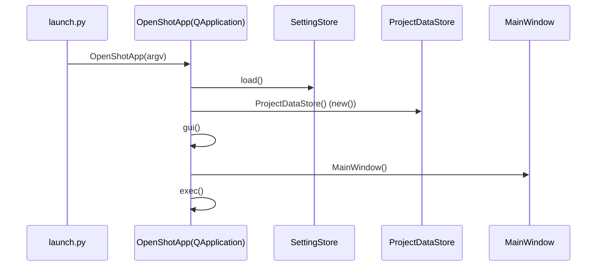
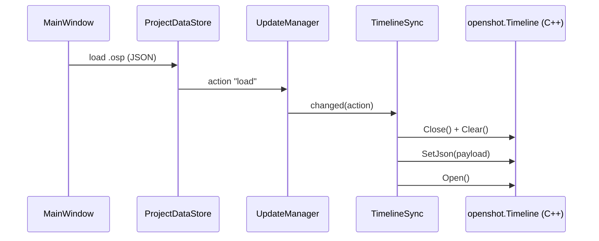
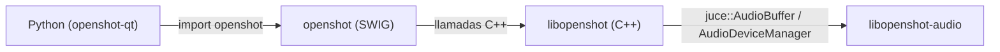
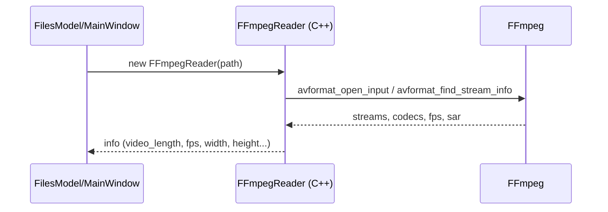
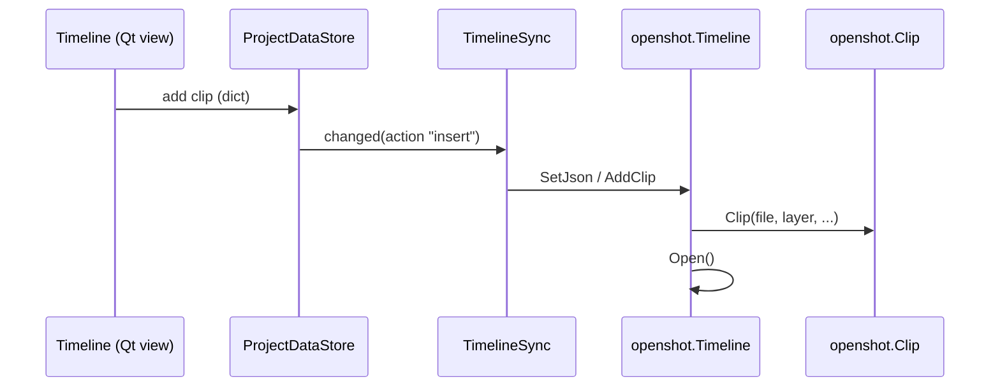
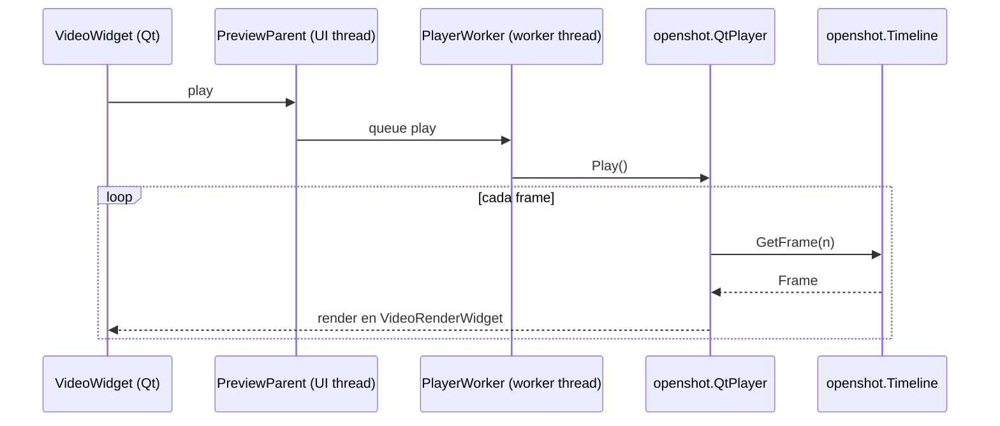
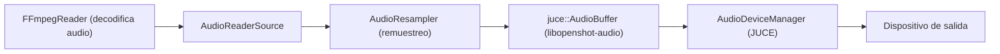
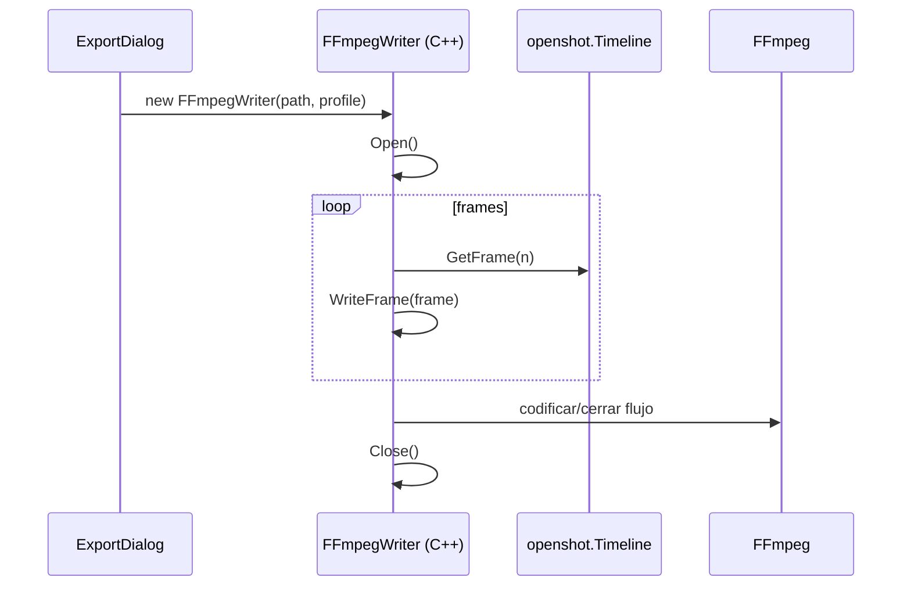
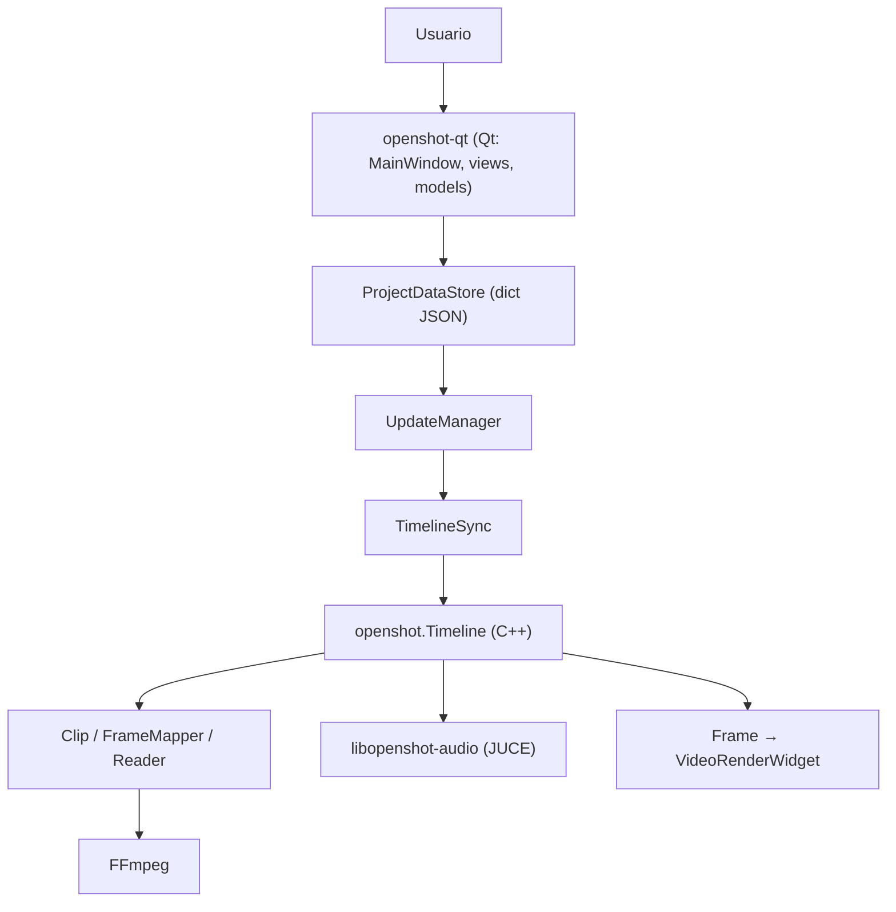

# FASE 4 — Arquitectura general

> Reconstrucción de la arquitectura real de OpenShot a partir del código.
> Cada afirmación se acompaña del archivo que la demuestra.

---

## 1. Relación entre los tres repositorios

- `openshot-qt` (Python/Qt) es la **interfaz** y no contiene motor multimedia.
- `libopenshot` (C++) es el **motor** de edición/reproducción/exportación.
- `libopenshot-audio` (C++/JUCE) es la **biblioteca de audio** que `libopenshot`
  consume para mezclar, remuestrear y reproducir audio.

Evidencias:
- `openshot-qt/src/classes/timeline.py:28` — `import openshot  # Python module
  for libopenshot (required video editing module installed separately)`.
- `libopenshot/bindings/python/openshot.i:12` — `%module("threads"=1) openshot`.
- `libopenshot/README.md:46` — libopenshot-audio «is used to mix, resample,
  host plug-ins, and play audio. It is based on the JUCE project».

---

## 2. Inicio de la aplicación

1. **Punto de entrada:** `openshot-qt/src/launch.py` → función `main()`.
   - `src/classes/info.py:206-210` declara `entry_points`:
     `openshot-qt = openshot_qt.launch:main`.
2. `launch.py` importa el binding Qt (`from qt_api import QtCore, QtWidgets`),
   intenta `import openshot` (bindings del motor), y crea la aplicación:
   `from classes.app import OpenShotApp` → `app = OpenShotApp(argv)`.
3. `OpenShotApp(QApplication)` (`src/classes/app.py:73`) inicializa:
   - `self.settings = settings.SettingStore(...)` (ajustes).
   - `self.project = project_data.ProjectDataStore()` (proyecto).
   - `self.updates = updates.UpdateManager()` (gestor de cambios).
   - `openshot.Settings.Instance().PATH_OPENSHOT_INSTALL = info.PATH`.
4. `app.gui()` crea la ventana principal:
   - `from windows.main_window import MainWindow` → `self.window = MainWindow()`.
5. `app.exec()` inicia el bucle de eventos.

---

## 3. Clases fundamentales

| Responsabilidad | Clase | Archivo |
|---|---|---|
| Aplicación | `OpenShotApp(QApplication)` | `openshot-qt/src/classes/app.py` |
| Ventana principal | `MainWindow` | `openshot-qt/src/windows/main_window.py` |
| Modelo de proyecto | `ProjectDataStore(JsonDataStore, UpdateInterface)` | `openshot-qt/src/classes/project_data.py` |
| Almacén JSON genérico | `JsonDataStore` | `openshot-qt/src/classes/json_data.py` |
| Sincronización con motor | `TimelineSync(UpdateInterface)` | `openshot-qt/src/classes/timeline.py` |
| Reproducción (hilo) | `PreviewParent`, `PlayerWorker` | `openshot-qt/src/windows/preview_thread.py` |
| Motor (C++) | `openshot::Timeline`, `Clip`, `Frame`, ... | `libopenshot/src/` |
| Audio (C++) | JUCE `AudioDeviceManager`, etc. | `libopenshot-audio/` |

---

## 4. Modelo de proyecto y serialización (`.osp`)

- El proyecto se representa en memoria como un **diccionario Python** dentro de
  `ProjectDataStore` (`src/classes/project_data.py`). Contiene claves como
  `fps`, `width`, `height`, `sample_rate`, `channels`, `channel_layout`,
  `layers`, `files`, `clips`, `effects`, `markers`, `history` (ver
  `src/classes/timeline.py:45-60`).
- La persistencia la implementa `JsonDataStore` (`src/classes/json_data.py`)
  usando el módulo estándar `json` (`get/set` serializan con
  `json.loads(json.dumps(...))`; `read_from_file`/`write_to_file` cargan/guardan).
- El proyecto por defecto está en `src/settings/_default.project`.
- **Guardado:** `MainWindow.save_project(file_path)` (`src/windows/main_window.py:574`).
- **Apertura:** se lee el `.osp`, se carga en `ProjectDataStore` y se emite una
  acción `"load"` que `TimelineSync.changed()` propaga al motor con
  `self.timeline.SetJson(payload)` (`src/classes/timeline.py:94-110`).

---

## 5. Comunicación Python ↔ C++ (SWIG)

- El binding se genera con **SWIG** desde `libopenshot/bindings/python/openshot.i`.
  El módulo resultante se importa en Python como `openshot`.
- `openshot.i` (líneas 12–44) declara `%module("threads"=1) openshot`, incluye
  tipemaps STL (`std_string`, `std_vector`, `std_map`, `std_shared_ptr`) y marca
  `openshot::Frame` y `juce::AudioBuffer<float>` como `%shared_ptr`.
- La API expuesta a Python son las clases C++ de `libopenshot/src`.
- Caso especial: `QtPlayer::SetQWidget(uintptr_t)` existe «due to SIP and SWIG
  incompatibility in the Python bindings» (`libopenshot/src/QtPlayer.h:92`).

---

## 6. Importación de archivos

1. El usuario arrastra/importa un archivo; `MainWindow`/`FilesModel`
   (`src/windows/models/files_model.py`) lo registra.
2. Se crea un `reader` (p. ej. `openshot.FFmpegReader`) en C++ que inspecciona
   el medio (códecs, fps, resolución, streams) vía FFmpeg.
3. Los metadatos se guardan en el proyecto (`files`) y se generan miniaturas
   (`src/classes/thumbnail.py`).

---

## 7. Inserción de un clip en la timeline

1. El clip se añade al diccionario del proyecto (`clips` / `layers`).
2. `UpdateManager` notifica a `TimelineSync.changed()`.
3. `TimelineSync` sincroniza el motor: `timeline.SetJson(...)` / `Open()`.
4. El motor (`openshot::Timeline`) construye `Clip`, `FrameMapper` y lectores.

---

## 8. Reproducción del visor

- La reproducción se ejecuta en un **hilo separado**: `preview_thread.py`
  define `PreviewParent` (hilo de UI) y `PlayerWorker` (hilo de trabajo).
- El motor usa `openshot::QtPlayer` (`libopenshot/src/Qt/`) y
  `FrameMapper`/`ReaderBase` para producir frames; el frame se entrega al
  `VideoRenderWidget` (widget Qt).
- `PreviewParent.onPositionChanged` mueve el playhead
  (`src/windows/preview_thread.py:66-68`).

---

## 9. Flujo de audio

- `libopenshot` lee audio vía `FFmpegReader`/`AudioReaderSource` y lo mezcla
  (`AudioBufferSource`, `AudioResampler`) con `libopenshot-audio` (JUCE).
- JUCE gestiona el dispositivo de salida (WASAPI/DirectSound/ASIO en Windows;
  CoreAudio en macOS; ALSA/JACK en Linux) según `libopenshot/README.md:24`.
- `libopenshot/src/AudioDevices.*` y `AudioResampler.*` conectan con JUCE.

---

## 10. Exportación

1. `MainWindow` abre el diálogo `Export` (`src/windows/export.py`).
2. Se crea un `openshot.FFmpegWriter` (C++) con los parámetros del preset.
3. Un bucle solicita `timeline.GetFrame(n)` y escribe cada frame en el writer.
4. FFmpeg codifica el flujo de salida (con aceleración hardware opcional).

---

## 11. Actualización de la interfaz ante cambios

- El patrón central es **observador**: `UpdateManager` mantiene una lista de
  `UpdateInterface` y propaga acciones (`action`) con su clave, tipo y JSON.
- `src/classes/updates.py` define `UpdateManager` y `UpdateInterface`.
- `TimelineSync.changed()` (`src/classes/timeline.py:73`) y
  `PreviewParent.changed()` (`src/windows/preview_thread.py:48`) son oyentes.
- Las vistas/modelos Qt reaccionan a cambios del diccionario del proyecto y
  refrescan sus modelos.

---

## 12. Localización y carga de `libopenshot`

- `import openshot` carga el módulo SWIG (`src/classes/timeline.py:28`,
  `src/launch.py:63`).
- En Windows empaquetado, `launch.py:50-58` añade al `PATH` los directorios de
  DLL de Qt para que las dependencias nativas se resuelvan.
- `OpenShotApp.__init__` fija `openshot.Settings.Instance().PATH_OPENSHOT_INSTALL`
  (`src/classes/app.py:140`).
- La versión se comprueba en `check_libopenshot_version` (`src/classes/app.py:128`),
  frente a `info.MINIMUM_LIBOPENSHOT_VERSION = "1.0.0"` (`src/classes/info.py:32`).

---

## 13. Integración de `libopenshot-audio`

- `libopenshot` enlaza con `libopenshot-audio` (JUCE) para mezcla/remuestreo/
  reproducción (`libopenshot/README.md:46`, `INSTALL.md:43`).
- Clases puente en `libopenshot/src`: `AudioDevices.*`, `AudioResampler.*`,
  `AudioReaderSource.*`, `AudioBufferSource.*`, `AudioRecorder.*`.
- El binding SWIG expone `juce::AudioBuffer<float>` (`openshot.i:52`).

---

## 14. FFmpeg (lectura/escritura)

- `FFmpegReader` decodifica (`libopenshot/src/FFmpegReader.cpp`) y `FFmpegWriter`
  codifica (`libopenshot/src/FFmpegWriter.cpp`).
- Enlaza componentes: `avcodec avdevice avformat avutil swscale`
  (`src/CMakeLists.txt:435`).
- Aceleración hardware: `USE_HW_ACCEL` (`src/CMakeLists.txt:76`).

---

## 15. Generación y entrega de un frame

1. `Timeline::GetFrame(n)` agrega clips activos en el instante `n`.
2. Cada `Clip` usa su `FrameMapper`/`ReaderBase` para obtener el frame origen.
3. Se aplican efectos/transiciones y keyframes (composición).
4. El `Frame` resultante se cachea (`CacheMemory`/`CacheDisk`) y se devuelve.
5. En reproducción, `QtPlayer` entrega el frame al `VideoRenderWidget` (Qt).

---

## 16. Serialización de objetos (JSON)

- Aplicación: `JsonDataStore` (`src/classes/json_data.py`) usa `json`.
- Motor C++: `Json.h`/`Json.cpp` y `jsoncpp` (vendored en `thirdparty/jsoncpp/`).
  Las clases del motor implementan `SetJson`/`Json`.

---

## 17. Efectos y transiciones

- **Efectos (C++):** `libopenshot/src/effects/` y `src/audio_effects/`; heredan
  de `EffectBase` (`src/EffectBase.*`).
- **Definiciones en UI:** `openshot-qt/src/effects/` y `src/transitions/`.
- **Efectos Qt:** `QtImageReader`, `QtTextReader`, `QtHtmlReader`.

---

## 18. Keyframes

- C++: `KeyFrame` y `AnimatedCurve` (`src/KeyFrame.*`, `AnimatedCurve.*`),
  `Point`, `Coordinate`, `Fraction`.
- Python: `src/classes/keyframe_scaler.py`, `animation_presets.py`.

---

## 19. Undo / redo

- Gestionado por el historial del proyecto (clave `history`) y el `UpdateManager`.
- `MainWindow.updateStatusChanged(False, False)` limpia el historial al iniciar
  (`src/classes/app.py:282`).
- `TimelineSync` ignora la clave `history` para no re-sincronizar el motor
  (`src/classes/timeline.py:77`).

---

## 20. Eventos, señales y slots

- Qt usa señal/slot; en Python se declaran con `pyqtSignal`/`pyqtSlot` vía la
  abstracción `qt_api` (p. ej. `preview_thread.py:34`).
- Señales relevantes: `SeekSignal`, `refreshFrameSignal`, `PauseSignal`,
  `RecoverBackup`, `MaxSizeChanged` (`timeline.py`, `preview_thread.py`, `app.py`).

---

## 21. Threads, workers y procesos

- **Reproducción:** `PlayerWorker` en hilo separado (`src/windows/preview_thread.py`).
- **Logging:** `LoggerLibOpenShot(Thread)` (`src/classes/logger_libopenshot.py:37`).
- **Generación IA:** `_GenerationWorker`, `GenerationQueueManager` (QObject)
  (`src/classes/generation_queue.py`), `GenerationService`.
- **Procesos externos:** Blender (títulos 3D), ComfyUI (`src/classes/comfy_client.py`).

---

## 22. Cachés y buffers

- **Caché del motor:** `CacheBase`, `CacheMemory`, `CacheDisk`
  (`libopenshot/src/Cache*.h/.cpp`); `VideoCacheThread` (`src/Qt/`).
- **Caché de preview:** `info.PREVIEW_CACHE_PATH` (`src/classes/info.py:62`).
- **Miniaturas:** `info.THUMBNAIL_PATH` + `src/classes/thumbnail.py`.

---

## 23. Logs y errores

- **Aplicación:** `src/classes/logger.py` (redirige stdout/stderr a logging),
  `src/classes/logger_libopenshot.py` (hilo que captura logs del motor).
- **Motor C++:** `ZmqLogger` (`libopenshot/src/ZmqLogger.*`) publica logs vía
  ZeroMQ; `CrashHandler` (`src/CrashHandler.*`).
- **Telemetría de errores:** `src/classes/sentry.py` (Sentry SDK).
- **Excepciones:** `libopenshot/src/Exceptions.h`.

---

## 24. Detección de capacidades hardware

- Aceleración de codificación/decodificación: `USE_HW_ACCEL` y detección en
  `FFmpegReader.cpp`/`FFmpegWriter.cpp` (VA-API, NVDEC, NVENC, QSV, D3D9/D3D11, VTB).
- Iconos de estado en `openshot-qt/images/hw-accel-*.svg` y `images/generate_cache.py`.

---

## 25. Partes específicas de Windows

- `src/launch.py:50-58` — añade directorios de DLL de Qt al `PATH`.
- `installer/windows-installer.iss`, `isportable.iss` (Inno Setup).
- `installer/package_msix.ps1` + `openshot-msix-template.xml` (MSIX).
- `installer/launch-win.bat`, `qt.conf`, `windows.manifest`.
- Drivers de audio JUCE en Windows: WASAPI, DirectSound, ASIO
  (`libopenshot/README.md:24`).
- Build con MinGW/MSYS2 (`libopenshot/doc/INSTALL-WINDOWS.md`); MSVC no soportado
  (`INSTALL.md:170`).

---

## 26. Resumen del flujo de datos global

